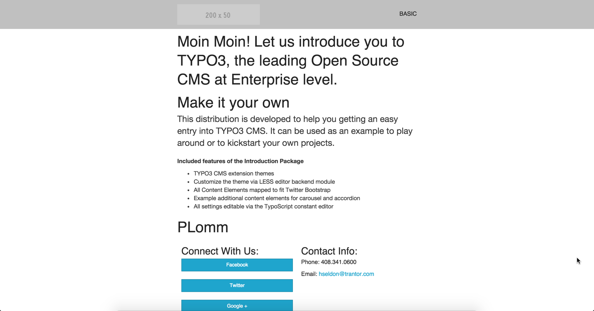

# theme_zurbink
Quickly create responsive HTML emails that work on any device &amp; client. Even Outlook. http://zurb.com/ink/

To achieve that this repository contains a base template for sending email newsletters based on zurb foundations ink templates.

Based on
* http://zurb.com/ink/
* https://github.com/zurb/ink

The Ink framework is licensed under the MIT License
* https://github.com/zurb/ink/blob/master/LICENSE.md
